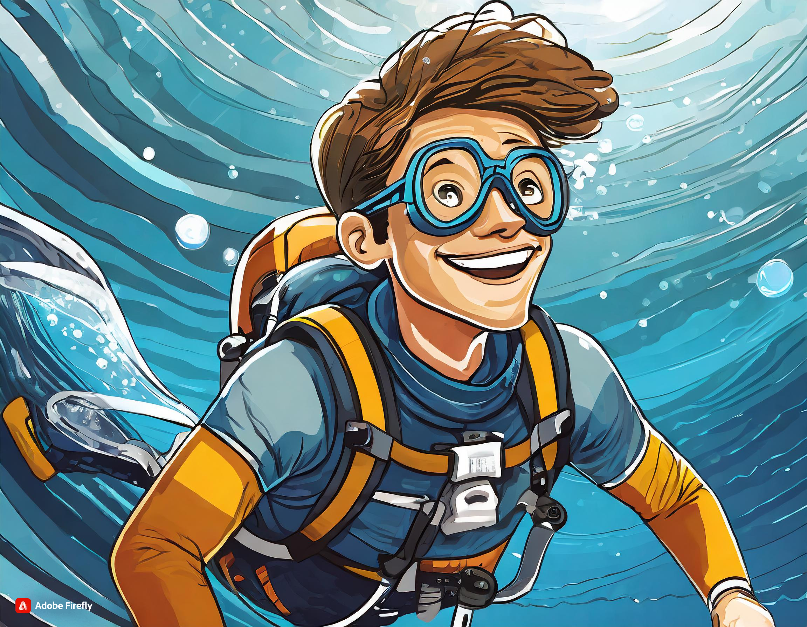

# Proyecto Storytelling (template): 
### my_storytelling
Plantilla para crear el storytelling (CDNCAV-b)

Autores:  
<!---
Incluir lista de personas del grupo 
Se puede añadir enlace a página personal de github o lo que se quiera...(optativo)
-->

- :man: ENRIQUE
- :woman:VALERIA
- :woman: ANA

Proyecto (código): 

Tipo/Género:  
- [ ] FictionCiberpunk  
- [ ] Reality/tribus urbanas  
- [x] Comic

## Resumen
Dos aventureros luchan con una nueva especie de calamar al tratar de llegar a los restos del Titanic.

### Personaje
Sally

Hank

Harry

### Historia
Sally es una estudiante ejemplar, estudiaba biología marina en la universidad de Western Kentucky University. Era una gran activista y amante del mar y sus especies, por lo que luchaba mucho por ayudar al medio ambiente y asistía a múltiples protestas. Después de asistir a una manifestación sobre las compras compulsivas, Sally conoce a Harry. 
Harry estaba trabajando como investigador marino, le apasiona bucear y descubrir todo sobre el océano. Tras conectar profundamente esa tarde de enero, empiezan a conocerse y a hacer múltiples viajes juntos. Es en Julio cuando deciden viajar a Canadá para visitar los restos del Titanic, donde encontrarán a Hank, el que se sentirá atacado al ver a humanos en su lugar favorito y se enfrentará a ellos.  

### Contexto
Nos encontramos en Kentucky año 2022 donde el capitalismo sobrepasa los limites y las técnologóias son imprescindibles, con un pueblo que se enfrenta a esta situación. 

### Conflicto 
El conflicto de Sally parte de su lucha con Hank, al que se suma la presencila de Harry, el cual tendrá que enfrentarse a este también. Temiendo Sally por su vida y la de Harry. 

### Productos

- Personajes: (img personaje y enlace a interactivo)
   
  Sally( Personaje principal)
   
  Harry (Personaje secundario)
    
  Hank (Personaje terciario)
  
- Interactivo:
- QUIZZ
   
https://h5p.org/node/1479682
   
  
-  EL CUARTO DE SALLY
  
1.  https://quizzlasombra.h5p.com/content/1292222050010450407
   
2.  https://quizzlasombra.h5p.com/content/1292222057851722047
   
3.  https://quizzlasombra.h5p.com/content/1292222060210961317
   
4.  https://quizzlasombra.h5p.com/content/1292222053827739627

- Banner/Teaser:  (enlace) 

- Storytelling: (enlace) 

### Conclusiones/Valoración del equipo

------

<!---
Lista completa de emojis de markDown - https://gist.github.com/rxaviers/7360908) 
-->

Febrero, 202X

Proyecto dentro de la serie [COMAV Stories](https://github.com/mgea/storytelling/blob/master/What_is_a_digital_storytelling.md) 
Proyectos seleccionados de [2023](https://github.com/mgea/storytelling/tree/master/2023), [2022](https://github.com/mgea/storytelling/blob/master/2022/readme.md) / [2021](https://github.com/mgea/storytelling/blob/master/2021/readme.md) / [2020](https://github.com/mgea/storytelling/blob/master/2020/readme.md)  / 
[2019](https://github.com/mgea/storytelling/blob/master/2019/readme.md) / [2018](https://github.com/mgea/storytelling/blob/master/2018/readme.md) 

CC BYNCSA  [Creacion y Difusión de Nuevos Contenidos Audiovisuales](http://utopolis.ugr.es/medialab)
 

[Facultad de Comunicación y Documentación](http://fcd.ugr.es)

Universidad de Granada
